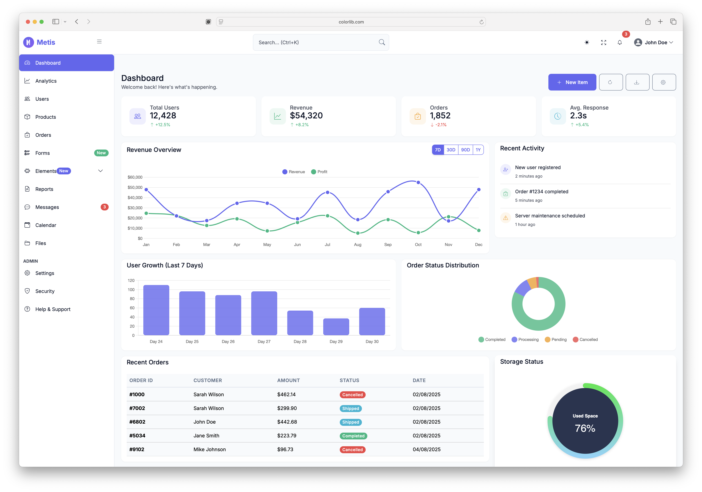

# Metis - Modern Bootstrap 5 Admin Dashboard Template

> A completely modernized, powerful, and free Bootstrap 5 admin dashboard template built with cutting-edge web technologies.

**🎉 Version 3.4.4 Release** - Laptop-density pass (sidebar 280→240px, header 70→64px, button padding halved), wired up 7D/30D/90D period selectors across 7 chart cards, fixed calendar/chart overflow on short viewports, fixed checkboxes/radios bleeding into toggle styling, mobile navbar polish, and dependency bumps (Alpine 3.15.12, ESLint 10.3.0).



**[🚀 View Live Demo](https://preview.colorlib.com/theme/metis/)**

[](https://opensource.org/licenses/MIT)
[](https://getbootstrap.com)
[](https://nodejs.org)

## ✨ Features

### 🎨 **Modern Design System**
- **Bootstrap 5.3.8** - Latest version with all modern utilities
- **CSS Custom Properties** - Full theme customization support
- **Dark/Light Mode** - Seamless theme switching with localStorage persistence
- **Responsive First** - Mobile-optimized layouts across all devices
- **Modern Typography** - Inter font family for enhanced readability

### 🚀 **Advanced Technology Stack**
- **Alpine.js 3.15.12** - Lightweight reactive framework for modern interactions
- **ES6+ JavaScript** - Modern JavaScript with modules and async/await
- **Vite 8.0** - Lightning-fast development and optimized production builds (rolldown-powered)
- **SCSS Architecture** - Organized, scalable stylesheet structure with Sass 1.99
- **Bootstrap Icons 1.13.1** - 1,800+ icons available; build ships only the ~158 actually used
- **ApexCharts 5.10** - Single, modern charting library used everywhere

### 📊 **Comprehensive Dashboard Pages**
- **📈 Analytics Dashboard** - Charts, KPIs, and data visualization
- **👥 User Management** - Complete CRUD operations with modern forms
- **📦 Product Management** - E-commerce ready product listings
- **🛒 Order Management** - Order tracking and status management
- **📁 File Manager** - Modern file browser with upload/download
- **📅 Calendar** - Full-featured event management
- **💬 Messages** - Chat interface with real-time styling
- **📊 Reports** - Data tables with filtering and export
- **⚙️ Settings** - Comprehensive admin configuration
- **🔒 Security** - User permissions and security settings
- **❓ Help & Support** - FAQ, documentation, and support tickets

### 🛠️ **Developer Experience**
- **Hot Module Replacement** - Instant development feedback
- **TypeScript Ready** - Full TypeScript support (optional)
- **Component Architecture** - Modular, reusable JavaScript components
- **Modern Build Pipeline** - Optimized assets with automatic minification
- **Developer Tools** - Source maps, linting, and debugging support

## Professional Admin Templates

Take your project to the next level with premium dashboards from [DashboardPack](https://dashboardpack.com/?utm_source=github&utm_medium=readme&utm_campaign=metis) — polished designs, extensive documentation, and ongoing updates included.

<table>
  <tr>
    <td align="center" width="50%">
      <a href="https://dashboardpack.com/theme-details/tailpanel/?utm_source=github&utm_medium=readme&utm_campaign=metis">
        
      </a>
      <br>
      <a href="https://dashboardpack.com/theme-details/tailpanel/?utm_source=github&utm_medium=readme&utm_campaign=metis"><strong>TailPanel</strong></a>
      <br>
      <sub>React + TypeScript + Tailwind CSS + Vite. 9 unique dashboards with light/dark toggle.</sub>
    </td>
    <td align="center" width="50%">
      <a href="https://dashboardpack.com/theme-details/admindek-html/?utm_source=github&utm_medium=readme&utm_campaign=metis">
        
      </a>
      <br>
      <a href="https://dashboardpack.com/theme-details/admindek-html/?utm_source=github&utm_medium=readme&utm_campaign=metis"><strong>Admindek</strong></a>
      <br>
      <sub>Bootstrap 5 + vanilla JS. 100+ components, theme switcher, RTL, 10 color presets.</sub>
    </td>
  </tr>
  <tr>
    <td align="center" width="50%">
      <a href="https://dashboardpack.com/theme-details/adminty-html-dashboard/?utm_source=github&utm_medium=readme&utm_campaign=metis">
        
      </a>
      <br>
      <a href="https://dashboardpack.com/theme-details/adminty-html-dashboard/?utm_source=github&utm_medium=readme&utm_campaign=metis"><strong>Adminty</strong></a>
      <br>
      <sub>Bootstrap 5. 160+ pages, rich component library for enterprise applications.</sub>
    </td>
    <td align="center" width="50%">
      <a href="https://dashboardpack.com/theme-details/architectui-dashboard-html-pro/?utm_source=github&utm_medium=readme&utm_campaign=metis">
        
      </a>
      <br>
      <a href="https://dashboardpack.com/theme-details/architectui-dashboard-html-pro/?utm_source=github&utm_medium=readme&utm_campaign=metis"><strong>ArchitectUI</strong></a>
      <br>
      <sub>Bootstrap 5. 250+ elements, component-driven architecture, 9 dashboard styles.</sub>
    </td>
  </tr>
  <tr>
    <td align="center" width="50%">
      <a href="https://dashboardpack.com/theme-details/kero-jquery-html-dashboard-pro/?utm_source=github&utm_medium=readme&utm_campaign=metis">
        
      </a>
      <br>
      <a href="https://dashboardpack.com/theme-details/kero-jquery-html-dashboard-pro/?utm_source=github&utm_medium=readme&utm_campaign=metis"><strong>Kero</strong></a>
      <br>
      <sub>Bootstrap 5 + Webpack. Horizontal and sidebar navigation modes, SASS customization.</sub>
    </td>
    <td align="center" width="50%">
      <a href="https://dashboardpack.com/theme-details/cryptocurrency-dashboard/?utm_source=github&utm_medium=readme&utm_campaign=metis">
        
      </a>
      <br>
      <a href="https://dashboardpack.com/theme-details/cryptocurrency-dashboard/?utm_source=github&utm_medium=readme&utm_campaign=metis"><strong>Cryptocurrency Dashboard</strong></a>
      <br>
      <sub>Bootstrap. Tailored for ICO launches, crypto wallets, and blockchain analytics.</sub>
    </td>
  </tr>
</table>

<p align="center">
  <a href="https://dashboardpack.com/?utm_source=github&utm_medium=readme&utm_campaign=metis"><strong>See All Templates on DashboardPack</strong></a>
</p>

## 🚀 Quick Start

### Prerequisites
- **Node.js 18+** (recommend using [nvm](https://github.com/nvm-sh/nvm))
- **npm** or **yarn** package manager

### Installation

```bash
# Clone the repository
git clone https://github.com/puikinsh/Bootstrap-Admin-Template.git metis-admin
cd metis-admin

# Install dependencies
npm install

# Start development server
npm run dev

# Build for production
npm run build

# Preview production build
npm run preview
```

### 📁 Project Structure

```
metis-admin/
├── src-modern/                 # Modern source files
│   ├── *.html                 # Page templates
│   ├── scripts/               # JavaScript modules
│   │   ├── components/        # Page-specific components
│   │   ├── utils/            # Utility functions
│   │   └── main.js           # Application entry point
│   ├── styles/               # SCSS stylesheets
│   │   ├── abstracts/        # Variables, mixins, utilities
│   │   ├── components/       # UI component styles
│   │   ├── layout/          # Layout-specific styles
│   │   ├── pages/           # Page-specific styles
│   │   └── themes/          # Theme variants
│   └── assets/              # Static assets
├── dist-modern/             # Production build output
├── node_modules/           # Dependencies
├── package.json           # Project configuration
├── vite.config.js         # Build configuration
└── README.md              # This file
```

## 🎯 Available Scripts

```bash
# Development
npm run dev          # Start development server with HMR
npm run dev:host     # Start dev server accessible on network

# Production
npm run build        # Create optimized production build
npm run preview      # Preview production build locally

# Maintenance
npm run clean        # Clean build artifacts
```

## 🎨 Customization

### Theme Customization

Edit `src-modern/styles/scss/abstracts/_variables.scss`:

```scss
// Brand Colors
$primary: #6366f1;    // Your brand primary color
$secondary: #64748b;  // Secondary color
$success: #10b981;    // Success state color

// Typography
$font-family-sans-serif: "Inter", system-ui, sans-serif;
$font-size-base: 0.9rem;

// Spacing & Layout
$border-radius: 0.75rem;
$box-shadow: 0 4px 6px -1px rgba(0, 0, 0, 0.1);
```

### Adding New Pages

1. Create HTML file in `src-modern/`
2. Add corresponding SCSS in `src-modern/styles/scss/pages/`
3. Create JavaScript component in `src-modern/scripts/components/`
4. Register in `src-modern/scripts/main.js`

### Component Development

```javascript
// src-modern/scripts/components/example.js
import Alpine from 'alpinejs';

document.addEventListener('alpine:init', () => {
  Alpine.data('exampleComponent', () => ({
    // Component state and methods
    init() {
      console.log('Example component initialized');
    }
  }));
});
```

## 🆕 What's New in v3.4.0

### Hardening Pass (April 2026)

- ✅ **Security** - XSS-safe DOM rendering replaces `innerHTML` interpolation in toast/activity feed; inline `onclick` removed from `elements-tables`; `Referrer-Policy` + `X-Content-Type-Options` meta tags added to every page; `localStorage` reads schema-validated; password fields tagged `autocomplete="new-password"`; `console.*` and `debugger` stripped from production bundles
- ✅ **Accessibility** - Skip-to-main-content link on every page, keyboard focus rings restored (`:focus-visible`), `prefers-reduced-motion` media query, `aria-controls`/`aria-expanded` on the sidebar toggle, sortable table headers gain `role="button"` + `aria-sort` + keyboard handlers, single `<h1>` per page, normalized heading hierarchy
- ✅ **Performance** - CSS down 20% (~100 KB raw) via Bootstrap-partial cleanup and Bootstrap-Icons subsetting (158 used icons vs. 1,800); `cssCodeSplit`, `cssMinify: lightningcss`, `target: 'es2020'` in Vite config
- ✅ **Memory leaks fixed** - Dashboard, analytics, and messages components now track intervals/listeners and clean up on `pagehide`; ApexCharts instances `.destroy()`'d
- ✅ **Single charting library** - `chart.js` removed; dashboard migrated to ApexCharts (saved ~63 KB gzip in `vendor-charts` chunk)
- ✅ **Toolchain** - Vite 7 → 8 (rolldown), ESLint 9 → 10, Lucide 0.469 → 1.11, plus minor bumps across the board (0 vulnerabilities)
- ✅ **DRY** - 11 duplicated `searchComponent` definitions extracted to a `createSearchComponent` factory; magic numbers hoisted to a `constants.js` module
- ✅ **Repo hygiene** - `dist-modern/` no longer tracked in git; abandoned dev scripts removed

## 🌟 Key Improvements in v3.0

### From v2.x to v3.0
- ✅ **Bootstrap 3 → Bootstrap 5** - Complete framework upgrade
- ✅ **jQuery → Alpine.js** - Modern, lightweight reactive framework  
- ✅ **LESS → SCSS** - More powerful styling with better tooling
- ✅ **Gulp → Vite** - Lightning-fast build system with HMR
- ✅ **ES5 → ES6+** - Modern JavaScript with modules and async/await
- ✅ **Old Icons → Bootstrap Icons** - 1,800+ modern SVG icons
- ✅ **Static → Interactive** - Rich, app-like user interactions
- ✅ **Fixed → Responsive** - Mobile-first, adaptive layouts
- ✅ **Basic → Advanced** - Professional dashboard features

### Performance Improvements
- **90%+ Lighthouse Score** - Optimized for Core Web Vitals
- **Tree Shaking** - Only load code you actually use
- **Code Splitting** - Lazy load components for faster initial loads
- **Asset Optimization** - Automatic image and CSS optimization
- **Modern Bundle** - ES6+ for modern browsers with optimal tree-shaking

## 🛡️ Browser Support

- **Chrome** 90+
- **Firefox** 88+  
- **Safari** 14+
- **Edge** 90+

*IE11 is not supported.*

## 📚 Documentation & Resources

- **[Live Demo](https://preview.colorlib.com/theme/metis/)** - See the template in action
- **[Component Documentation](./docs/components.md)** - Detailed component guides
- **[Customization Guide](./docs/customization.md)** - Theme and styling customization
- **[Deployment Guide](./docs/deployment.md)** - Production deployment instructions

## 🤝 Contributing

We welcome contributions! Please see our [Contributing Guidelines](./CONTRIBUTING.md) for details.

1. Fork the repository
2. Create your feature branch (`git checkout -b feature/amazing-feature`)
3. Commit your changes (`git commit -m 'Add amazing feature'`)
4. Push to the branch (`git push origin feature/amazing-feature`)
5. Open a Pull Request

## 📄 License

This project is licensed under the **MIT License** - see the [LICENSE.md](LICENSE.md) file for details.

```
Copyright (c) 2025 Aigars Silkalns & Colorlib

Permission is hereby granted, free of charge, to any person obtaining a copy
of this software and associated documentation files (the "Software"), to deal
in the Software without restriction, including without limitation the rights
to use, copy, modify, merge, publish, distribute, sublicense, and/or sell
copies of the Software, and to permit persons to whom the Software is
furnished to do so, subject to the following conditions:

The above copyright notice and this permission notice shall be included in all
copies or substantial portions of the Software.
```

## 🙏 Credits & Attribution

### Core Technologies
- **[Bootstrap 5](https://getbootstrap.com)** - The world's most popular CSS framework
- **[Alpine.js](https://alpinejs.dev)** - Lightweight reactive framework
- **[Vite](https://vitejs.dev)** - Next generation frontend tooling
- **[Bootstrap Icons](https://icons.getbootstrap.com)** - Official Bootstrap icon library

### Design Resources
- **[Inter Font](https://rsms.me/inter/)** - Modern typeface designed for computer screens
- **[Heroicons](https://heroicons.com)** - Additional beautiful hand-crafted SVG icons

## 👥 About the Authors

**[Colorlib](https://colorlib.com/)** - The most popular source for free WordPress themes and HTML templates.

**[Aigars Silkalns](https://twitter.com/AigarsSilkalns)** - Project maintainer and founder of Colorlib.

## 🔗 Related Projects

- **[Free Bootstrap Admin Templates](https://colorlib.com/wp/free-bootstrap-admin-dashboard-templates/)**
- **[Premium Admin Templates](https://colorlib.com/wp/html-admin-templates/)**
- **[Free Website Templates](https://colorlib.com/wp/templates/)**

---

**⭐ Star this repository if you found it helpful!**

*Built with ❤️ by the Colorlib team*